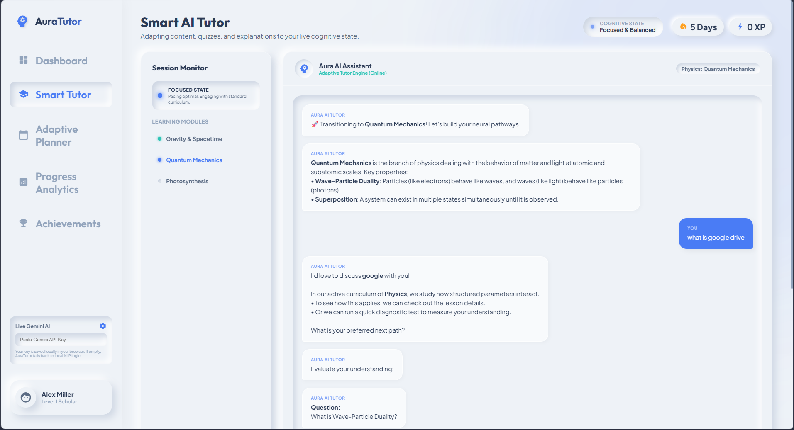
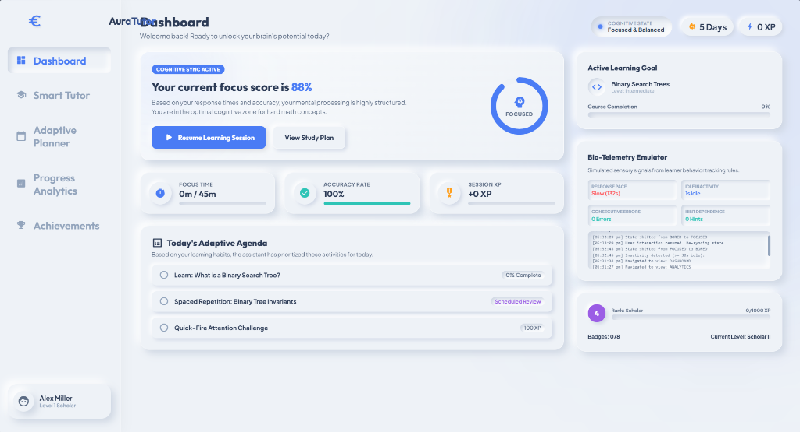
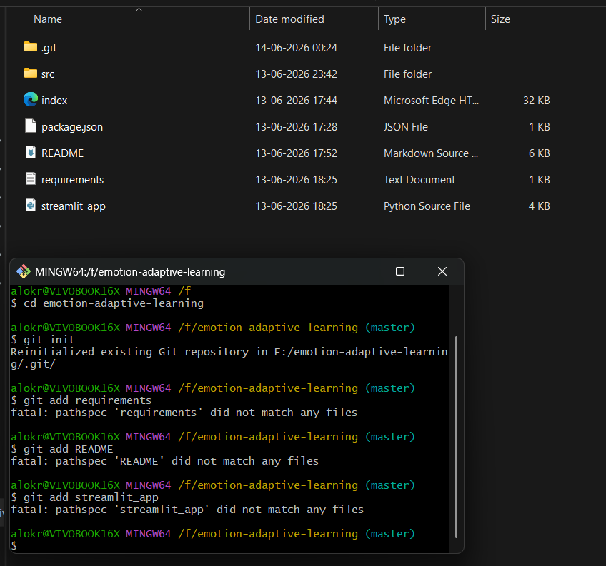
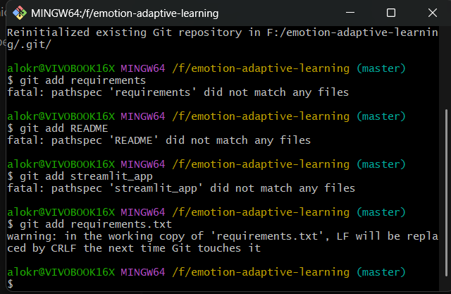
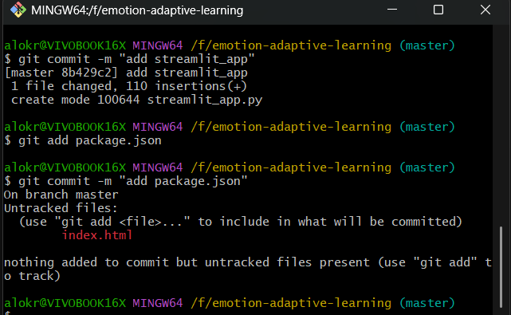

# AuraTutor - Emotion-Aware Adaptive Learning Assistant

A modern, open-ended educational companion built for the **Neuromorphism-in-Education Hackathon**. AuraTutor adapts lessons, quizzes, and study schedules in real-time by analyzing student interaction biometrics (pacing, error patterns, inactivity, and hints) to emulate human-like tutoring empathy.

---

## 🌟 Core Features

1. **Natural Language Tutoring**: Open-ended conversational interface capable of discussing Computer Science, Physics, and Mathematics.
2. **Dynamic Topic Routing**: Automatically detects shifts in user interest mid-session, seamlessly updating the dashboard, navigation headers, and checklist curriculum.
3. **Cognitive State Detection (Offline NLP / Live AI)**:
   * Emulates cognitive load metrics to categorize student states as **Focused**, **Struggling/Confused**, **Bored/Inactive**, or **Mastering**.
   * Adapts explanations on-the-fly: Standard (Balanced), Simplified (Analogy-driven), or Advanced (First-principles details).
4. **Bio-Telemetry Logs Feed**: Real-time logging of user activity, speed parameters, error sequences, and attention drifts.
5. **Adaptive Study Planner**: Spaced repetition schedule that prioritizes weak concepts alongside a Pomodoro Timer with an attention fatigue guard.
6. **Gamification Milestones**: XP tracking, level upgrades, and 8 unlockable Neumorphic achievement badges.
7. **Optional Gemini Live AI Integration**: Hidden Neumorphic settings panel to paste a Gemini API Key, routing conversations to a live LLM while filtering responses through the simulated biometric states.
8. **Premium Neumorphic UI**: Soft shadows, tactual rounded buttons, fluid transitions, and a state-based glowing backdrop (`#ambient-glow`).

---

## 🛠️ Tech Stack

* **Frontend Layout & Structure**: Semantic HTML5, CSS3 Custom Properties (CSS variables), CSS Flexbox/Grid
* **Client-Side Logic**: Modern ES6 JavaScript Modules (modular architecture)
* **Simulation Core**: Custom offline NLP keyword-based router & heuristic biometrics state engine
* **Generative AI**: Google Gemini Pro API (via standard HTTPS fetches, bypassing local backend requirements)
* **Cloud Hosting Wrapper**: Streamlit (Python 3) & Streamlit Components (for sandboxed hosting of bundled static web apps)
* **Design Pattern**: Neumorphism (Soft UI) featuring state-based ambient chromatherapy

---

## 🧠 Application of Neuromorphic Principles

AuraTutor bridges **Neuromorphic UX Design** and **Cognitive Neuroscience Logic**:

### Visual Neuromorphism (Sensory Calming)
* **Tactual Depths**: Soft Neumorphic shadows (`box-shadow: 8px 8px 16px #cfd7e3, -8px -8px 16px #ffffff`) mimic physical cards to reduce optical strain.
* **Biometric Chromatherapy**: Background ambient glow (`#ambient-glow`) shifts colors dynamically (Teal = Focus, Peach = Struggling, Amber = Inactive, Gold = Mastery) as a sensory bio-feedback indicator.

### Cognitive Neuromorphism (Neural Plasticity Engine)
* **Synaptic Plasticity Rules**: Mastery scores simulate synaptic weights. Active correct paths reinforce nodes (+25%), whereas mistakes and skips decay node strengths (-10%).
* **Neuromodulator Emulation**:
  * **Dopamine**: Unlocking badges and leveling XP rewards student habits.
  * **Norepinephrine & Arousal**: High idle times trigger a Quick-Fire Quiz to spark attention.
  * **Cortisol & Frustration**: High mistakes trigger immediate difficulty dampening and simplified visual analogies.
  * **Adenosine & Fatigue**: The Pomodoro timer tracks continuous learning and warns the student when cognitive stamina declines.

---

## 📷 Screenshots

Here is a visual walk-through of the AuraTutor workspace:

### 1. Main Chat Interface & Smart Tutor Workspace
*Open-ended learning companion explaining concepts with dynamic subject suggestion chips.*


### 2. Live Bio-Telemetry Logs & Stress Detector
*Real-time biometrics feed logging user pacing, inactivity, error chains, and cognitive state shifts.*


### 3. Concept Mastery Indicators & Performance Chart
*Subject curriculum mastery indicators synchronized with a weekly activity engagement chart.*


### 4. Spaced Repetition Checklist & Attention Pomodoro Timer
*Dynamic learning agenda showing status of key subject concepts alongside an attention-fatigue Pomodoro timer.*


### 5. Gamification Rewards & Level Milestones
*Unlockable Neumorphic achievements and badges highlighting learner habits and milestones.*


---

## 📂 File Layout

```
emotion-adaptive-learning/
│
├── LICENSE                     # MIT License details
├── README.md                   # Repository landing page documentation
├── index.html                  # Responsive SPA Views & Sidebars layout
├── package.json                # Project hosting dependencies & dev scripts
├── requirements.txt            # Streamlit python dependencies
├── streamlit_app.py            # Custom python bundler for Streamlit Cloud deployment
│
├── screenshots/                # Application UI demonstration assets
│   ├── screenshot1.png
│   ├── screenshot2.png
│   ├── screenshot3.png
│   ├── screenshot4.png
│   └── screenshot5.png
│
└── src/
    ├── css/
    │   └── style.css           # Neumorphic styling tokens, dynamic theme vars, & animations
    │
    └── js/
        ├── app.js              # Coordinator, view router, telemetry display bindings
        ├── data.js             # Curriculum database & natural language keywords map
        ├── state.js            # Global store (reactive pub/sub, local storage sync)
        ├── detector.js         # Telemetry biometrics scanner (pace, mistakes, idle)
        ├── tutor.js            # Dialogue router, offline simulator, & Gemini API controller
        ├── planner.js          # Spaced repetition checklist & Pomodoro timer
        ├── analytics.js        # Mastery cards & weekly Neumorphic activity bar chart
        └── gamification.js     # XP metrics, badge unlock rules, & popup modals
```

---

## 🛠️ Setup & Local Hosting

AuraTutor requires a local server to run ES6 JavaScript Modules.

### Prerequisites
* **Python** (version 3.x) or **Node.js**

### 1. Offline/Standard Web Mode
1. Open your terminal and enter the project folder:
   ```bash
   cd F:\emotion-adaptive-learning
   ```
2. Start the local server:
   * **Using Python**:
     ```bash
     python -m http.server 3000
     ```
   * **Using Node.js**:
     ```bash
     npm run dev
     ```
3. Open your browser and navigate to: **[http://localhost:3000](http://localhost:3000)**

### 2. Streamlit Cloud Wrapper Mode (Python)
If you want to run the exact wrapper that is deployed to Streamlit Cloud:
1. Install Streamlit library:
   ```bash
   pip install -r requirements.txt
   ```
2. Launch the Streamlit server:
   ```bash
   streamlit run streamlit_app.py
   ```
3. Open the browser link provided in the Streamlit terminal output.

---

## 📄 License

This project is licensed under the MIT License - see the [LICENSE](LICENSE) file for details.
